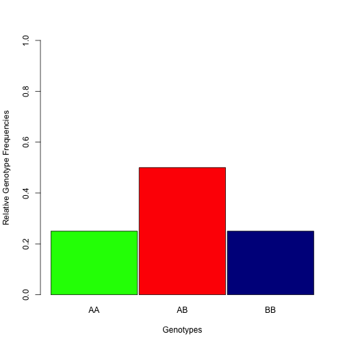

---
title       : As never Seen Before -- Hardy-Weinberg Equilibrium Calculator
subtitle    : Check if a gene is been Selected in a Population
author      : jocaqui 
job         : Genetics and Data Analysis
framework   : impressjs       # {io2012, html5slides, shower, dzslides, ...}
highlighter : prettify  # {highlight.js, prettify, highlight}
hitheme     : tomorrow      # 
widgets     : []            # {mathjax, quiz, bootstrap}
mode        : selfcontained # {standalone, draft}
knit        : slidify::knit2slides
--- 
<q>Have you ever wonder if **a gene** you know is under **Natural Selection**?</q>

--- x:500 y:1500
# Wonder no Further!!!!!!      
__Try the HWE Genetic Calculator App.__      
[HWE-APP](http://jocaqui.shinyapps.io/hwe_app)  
 
An easy to use Calculator to examine if a gene is in Hardy-Weinberg Equilibrium or not.    
     
*HWE: Hardy-Weinberg Equilibrium*    
--- 

--- .slide x:2000 y:2000 rot:45

# **What Exactly is the Hardy-Weinberg Equilibrium?**    
 
- The Hardy-Weinberg principle is commonly used in population genetic studies and states that a gene in a population should remain constant from generation to generation when there is not an effect of evolution going on.  
 
- A gene in a population is at Hardy-Weinberg Equilibrium when the population is mating randomly, size of the population is large and there is no migration, mutation or selection.  
 
You want to get more technical, go to [Wiki-HWE](http://en.wikipedia.org/wiki/Hardy%E2%80%93Weinberg_principle).  
 

--- #rstats x:2500 y:3500

To work the App, you will only need observed gene frequencies (i.e. AA, AB, BB genotypes) or just play with the sliders.  
 
[HWE-APP](http://jocaqui.shinyapps.io/hwe_app)  
 
The App uses the package [HardyWeinberg](http://cran.r-project.org/web/packages/HardyWeinberg/index.html) from the R-Project.  

--- x:4000 y:5500

The App will give a decision for HW equilibrium or not, a summary of frequencies and a barplot.  
 

Happy Apping and Coding!!!!!

